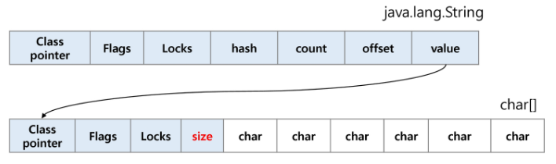

# **문자열**

## 컴퓨터에서의 문자표현

- 글자 A를 메모리에 저장하는 방법에 대해 생각해보자
- 물론 칼로 A라는 글자를 새기는 방식은 아닐 것이다. 메모리는 숫자만을 저장할 수 있기 때문에 A라는 글자의 모양 그대로 비트맵으로 저장하는 방법을 사용하지 않는 한(이 방법은 메모리 낭비가 심하다.) 각 문자에 대해서 대응되는 숫자를 정해 놓고 이것을 메모리에 저장하는 방법이 사용될 것이다.
- 영어가 대소문자 합쳐서 52이므로 6비트(64가지)면 모두 표현할 수 있다. 이를 코드체계라고 한다.
  - 000000 -> 'a', 000001 -> 'b'


- 네트워크가 발전하면서 서로 간에 정보를 주고 받을 때 정보를 달리 해석한다는 문제가 발생
- 이런 혼동을 피하기 위해 **`표준안`**을 만들기로 했다.
- 1967년 미국에서 ASCII(American Standard Code for Information Interchange)라는 문자 인코딩 표준이 제정되었다.
- ASCII는 **`7-bit(7bits) 인코딩`**으로 128문자를 표현하며 33개의 출력 불가능한 제어문자들과 공백을 비롯한 95개의 출력 가능한 문자들로 이루어져 있다.


## 확장 아스키

- 확장 아스키는 표준 문자 이외의 악센트 문자, 도형 문자, 특수 문자, 특수 기호 등 부가적인 문자를 128개 추가할 수 있게 하는 부호이다.
  - 표준 아스키는 7-bit를 사용하여 문자를 표현하는데 비해 확장 아스키는 **`1B내의 8-bit(8bits)를 모두 사용`**함으로써 추가적인 문자를 표현할 수 있다.
  - 컴퓨터 생산자와 소프트웨어 개발자가 여러 가지 다양한 문자에 할당할 수 있도록 하고 있다. 이렇게 할당된 확장 부호는 표준 아스키와 같이 서로 다른 프로그램이나 컴퓨터 사이에 교환되지 못한다.
  - 그러므로 표준 아스키는 프로그램이나 컴퓨터 또는 프린터가 그것을 해독할 수 있도록 설계되어 있어야만 올바로 해독될 수 있다.

- 오늘날 대부분의 컴퓨터는 문자를 읽고 쓰는데 ASCII형식을 사용한다.
- 그런데 컴퓨터가 발전하면서 미국 뿐 아니라 각 나라에서도 컴퓨터가 발전했으며 각 국가들은 자국의 문자를 표현하기 위하여 코드체계를 만들어서 사용하게 되었다.
  - 우리나라도 아주 오래된 이야기지만 한글 코드체계를 만들어 사용했고 조합형, 완성형 두 종류를 가지고 있었다.
- 인터넷이 전 세계로 발전하면서 ASCII를 만들었을 때의 문제와 같은 문제가 국가간에 정보를 주고 받을 때 발생했다.
- 자국의 코드체계가 타 국가가 가지고 있지 않으면 정보를 잘못 해석할 수 밖에 없었다.
- 그래서 다국어 처리를 위해 표준을 마련했는데, 이를 **`유니코드`**라고 한다.

## 유니코드

- 유니코드도 다시 Character Set으로 분류된다.
  - UCS-2(Universal Character Set 2)
  - UCS-4(Universal Character Set 4)
  - 유니코드를 저장하는 변수의 크기를 정의
  - 그러나, 바이트 순서에 대해서 표준화하지 못했다.
  - 다시 말해, 파일을 인식이 이 파일이 UCS-2, UCS-4인지 인식하고 각 경우를 구분해서 모두 다르게 구현해야 하는 문제 발생
  - 그래서 유니 코드의 적당한 외부 인코딩이 필요하게 되었다.

## 유니코드 인코딩(Unicode Transformation Format)

- UTF-8 (in web)
  - MIN : 8bit, MAX : 32bit (1 Byte * 4)
- UTF-16 (in windows, java)
  - MIN : 16bit, MAX : 32bit (2 Byte * 2)
- UTF-32 (in unix)
  - MIN : 32bit, MAX : 32bit (4 Byte * 2)

## Python 인코딩

- 2.x 버전 - ASCII -> #-*-coding: utf-8 -\*- (첫 줄에 명시)
- 3.x 버전 - 유니코드 UTF-8 -> 생략 가능
- 다른 인코딩 방식으로 처리 시 첫 줄에 작성하는 위 항목에 원하는 인코딩 방식을 지정해주면 된다.


## 문자열의 분류


## java에서 String 클래스에 대한 메모리 배치 예

- java.lang.String 클래스에는 기본적인 객체 메타 데이터 외에도 네 가지 필드들이 포함되어 있는데, hash값(hash), 문자열의 길이(count), 문자열 데이터의 시작점(offset), 그리고 실제 문자열 배열에 대한 참조(value)이다.



## java(객체지향 언어)에서의 문자열 처리

- 문자열 데이터를 저장, 처리해주는 클래스를 제공한다.
- String 클래스를 사용한다.

```java
String str="abc"; //또는 String str = new String("abc")
```

- 문자열 처리에 필요한 연산을 연산자, 메소드 형태로 제공한다.
  - +, length(), replace(), split(), substring(), ...
  - 보다 풍부한 연산을 제공한다.


## C언어에서의 문자열 처리

- 문자열은 문자들의 배열 형태로 구현된 응용 자료형
- 문자배열에 문자열을 저장할 떄는 항상 마지막에 끝을 표시하는 널문자('\0')를 넣어줘야 한다.

```c
char ary[]={'a', 'b', 'c', '\0'}; // 또는 char ary=[]="abc";
```

- 문자열 처리에 필요한 연산을 함수 형태로 제공한다.
  - strlen(), strcpy(), strcmp(), ...


## Python에서의 문자열 처리

- char 타입 없다.
- 텍스트 데이터의 취급방법이 통일되어 있다.
- 문자열 기호
  - ' '(홀따옴표), " "(쌍따옴표), ''' ''''(홀따옴표 3개), """ """(쌍따옴표 3개)
  - \+ 연결(Concatenation)
    - 문자열 + 문자열 : 이어 붙여주는 역할
  - \* 반복
    - 문자열 * 수 : 수만큼 문자열이 반복
- 문자열은 시퀀스 자료형으로 분류되고, 시퀀스 자료형에서 사용할 수 있는 인덱싱, 슬라이싱 연산들을 사용할 수 있다.
- 문자열 클래스에서 제공되는 메소드
  - replace(), split(), isalpha(), find()
- 문자열은 튜플과 같이 요소값을 변경할 수 없다.(immutable)


## C와 Java String처리의 기본적인 차이점

- C는 아스키 코드로 저장한다.
- Java는 유니코드(UTF16, 2byte)로 저장한다.
- 파이썬은 유니코드(UTF8)로 저장


## 문자열 뒤집기

- 자기 문자열에서 뒤집는 방법이 있고 새로운 빈 문자열을 만들어 소스의 뒤에서부터 읽어서 타겟에 쓰는 방법이 있다.
- 자기 문자열을 이용할 경우는 swap을 위한 임시 변수가 필요하며 반복 수행을 문자열 길이의 반만큼 수행해야 한다.
- C에서는 위의 알고리즘 대로 구현
- Java에서는 StringBuffer 클래스의 reverse() 메소드를 이용
- Python은 Reverse 함수 혹은 slice notation([::-1])을 이용

## 문자열 비교

- C strcmp()함수를 제공

```c
int my_strcmp(const char *str1, const char *str2)
{
    int i = 0;
    while(str[i] != '\0')
    {
        if(str1[i] != str2[i]) break;
        i++;
    }
    return (str1[i] - str2[i]);
}
```

- Java에서는 equals() 메소드를 제공
  - 문자열 비교에서 ==연산은 메모리 참조가 같은지 묻는 표현
- Python에서는 ==연산자와 is연산자를 제공
  - ==연산자는 내부적으로 특수 메서드 \__eq__()를 호출

## 문자열 숫자를 정수로 변환

- C에서는 atoi()함수를 제공, 역함수로 itoa()가 있다.

```c
int atoi(const char *string)
{
    int value = 0, digit, c;
    
    while ((c = *string++) != '\0') {
        if (c >= '0' && c <= '9')
            digit = c - '0';
        else
            break;
        
        value = (value * 10) + digit;
    }
    return value;
}
```

- Java에서는 숫자 클래스의 parse 메소드를 제공, 역함수로는 toString() 메소드를 제공
  - Integer.paeseInt(String)
- 파이썬에서는 숫자와 문자변환 함수를 제공
  - int(), float(), str(), repr()

# **패턴 매칭**

## 패턴 매칭에 사용되는 알고리즘

- 고지식한 패턴 검색 알고리즘
- 카프-라빈 알고리즘
- KMP 알고리즘
- 보이어-무어 알고리즘


## 고지식한 알고리즘(Brute Force)

- 본문 문자열을 처음부터 끝까지 차례대로 순회하면서 패턴 내의 문자들을 일일이 비교하는 방식으로 동작


```python
p = 'is'	# 찾을 패턴
t = 'This is a book~!'	# 전체 텍스트
M = len(p)	# 찾을 패턴의 길이
N = len(t)	# 전체 텍스트의 길이

def BruteForce(p, t):
    i = 0	# t의 인덱스
    j = 0	# p의 인덱스
    while j < M and i < N:
        if t[i] != p[j]:
            i = i-j
            j = -1
        i = i + 1
        j = j + 1
    if j == M :
        return i - M	# 검색 성공
    else:
        return -1		# 검색 실패
```

```python
for i in range(N-M):
    for j in range(M-1):
        if p[j] != t[i+j]:
            break
        if j = M-1:
            return i	# 시작 위치를 리텅
return -1	# 끝까지 return을 만나지 못했다면 실패
```

- 고지식한 패턴 검색 알고리즘의 시간 복잡도
  - 최악의 경우 시간 복잡도는 텍스트의 모든 위치에서 패턴을 비교해야 하므로 O(MN)이 된다.
  - 예에서는 최악의 경우 약 10,000*80 = 800,000번의 비교가 일어난다.


## KMP 알고리즘

- 불일치가 발생한 텍스트 스트링의 앞 부분에 어떤 문자가 있는지를 미리 알고 있으므로, 불일치가 발생한 앞 부분에 대하여 다시 비교하지 않고 매칭을 수랭

- 패턴을 전처리하여 배열 next[M]을 구해서 잘못된 시작을 취소한다.

  - next[M] : 불일치가 발생했을 경우 이동할 다음 위치

- 시간복잡도 : O(M+N)

  

- 텍스트에서 abcdabc까지는 매치되고, e에서 실패한 상황, 패턴의 맨 앞의 abc와 실패 직전의 abc는 동일함을 이용할 수 있다.
- 실패한 텍스트 문자와 P[4]를 비교한다.
- 매칭이 실패했을 때 돌아갈 곳을 준비해둬야 한다.


## 보이어-무어 알고리즘

- 오른쪽에서 왼쪽으로 비교
- 대부분의 상용 소프트웨어에서 채택하고 있는 알고리즘
- 보이어-무어 알고리즘은 패턴에 오른쪽 끝에 있는 문자가 불일칠하고 이 문자가 패턴 내에 존재하지 않는 경우, 이동거리는 무려 패턴의 길이만큼이 된다.


- 오른쪽 끝 문자가 불일치하고 이 문자가 패턴 내에 존재할 경우, 패턴에서 일치하는 문자를 찾아서 이동한다.


- 예시


## 문자열 매칭 알고리즘 비교

- 찾고자 하는 문자열 패턴의 길이 m, 총 문자열 길이 n
- 고지식한 패턴 알고리즘 : 수행시간 O(mn)
- 카프-라빈 알고리즘 : 수행시간 O(n)
- KMP 알고리즘 : 수행시간 O(n)
- 보이어-무어 알고리즘
  - 앞의 두 매칭 알고리즘들의 공통점은 택스트 문자열의 문자를 적어도 한 번씩 훑는다는 것이다.
  - 따라서 최선의 경우에도 O(n)
  - 보이어-무어 알고리즘은 텍스트 문자를 다 보지 않아도 된다.
  - 발상의 전환 : 패턴의 오른쪽부터 비교한다.
  - 최악의 경우 수행시간 : O(mn)
  - 입력에 따라 다르지만 일반적으로  O(n)보다 시간이 덜 든다.

